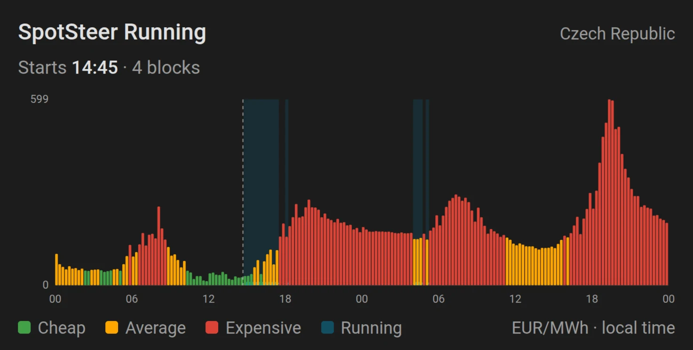

# SpotSteer for Home Assistant

[![hacs][hacs-shield]][hacs]
[![License][license-shield]][license]

SpotSteer runs your appliances in the cheapest hours of the day-ahead electricity market. Tell it how
many hours a device needs and when it has to be done; the SpotSteer backend picks the cheapest hours
for your bidding zone, and Home Assistant switches the device on and off.

The plan is fetched after midnight and again once tomorrow's prices publish (13:05 UTC), then
checked against the clock every 15 minutes. It is committed, not re-optimised during the day, so a
device never runs longer than you asked for. Keep your supplier and your hardware: anything Home
Assistant can switch becomes price-aware.

## Features

- Cheapest hours for any European zones, from ENTSO-E day-ahead prices.
- One unbroken run for a boiler or washer, or split across the cheapest hours for an EV.
- A deadline, and an optional window the device must never run in.
- Switches a device for you, or publishes a sensor your own automations can follow.
- Current price and a cheap / average / expensive level for the current slot.
- A bundled dashboard card: the day's prices with the planned hours shaded.
- A blueprint for driving any device from the plan without YAML.
- One config entry per appliance; add the integration again for the next one.

## Installation

### HACS

1. Open the repository in HACS, press **Download**, then restart Home Assistant.

   

2. Add the integration.

   

### Manual

1. Copy `custom_components/spotsteer/` into `config/custom_components/`.
2. Restart Home Assistant.
3. Settings → Devices & services → **Add integration** → **SpotSteer**.

## Configuration

Set up in the UI. Everything except the name can be changed later under **Configure**.

| Field | Required | Description |
| --- | --- | --- |
| Name | Yes | What to call this appliance. |
| Electricity zone | Yes | The day-ahead market your prices come from. Preselected from your Home Assistant location. |
| Controlled switch | No | A `switch` or `input_boolean` SpotSteer turns on and off. Leave empty to drive devices from your own automations. |

### Configuration entities

| Entity | Type | Description |
| --- | --- | --- |
| `number.spotsteer_duration` | Number | Hours of power the appliance needs. 0.25–24 in steps of 0.25, default 3. |
| `time.spotsteer_ready_by` | Time | When it has to be finished. Default 06:00. Cleared, the plan covers the next 24 hours. |
| `switch.spotsteer_continuous_block` | Switch | On: one unbroken run. Off (default): the cheapest hours wherever they fall. |
| `switch.spotsteer_unavailable_window` | Switch | Applies the do-not-run window below. Off by default. |
| `time.spotsteer_unavailable_from` / `_to` | Time | The do-not-run window. May wrap past midnight. |
| `switch.spotsteer_enabled` | Switch | Master switch. On by default. |
| `button.spotsteer_refresh_plan` | Button | Fetch a new plan now. |

Changing any of these fetches a new plan straight away.

## Entities

| Entity | Type | Description |
| --- | --- | --- |
| `binary_sensor.spotsteer_running` | Binary sensor | On during the planned hours. The one to automate on. |
| `sensor.spotsteer_current_price` | Sensor | Price of the current slot, in EUR/MWh. |
| `sensor.spotsteer_price_level` | Sensor | `green`, `yellow` or `red` (cheap, average, expensive) for the current slot. |
| `sensor.spotsteer_next_start` | Sensor | When the device next switches on. |
| `sensor.spotsteer_next_end` | Sensor | When the current or next run ends. |

## Sensor attributes

`binary_sensor.spotsteer_running`

| Attribute | Description |
| --- | --- |
| `scheduled` | `false` when the job does not fit the window. Never a partial plan. |
| `blocks` | The planned runs: `start_utc`, `end_utc`, `eur_per_mwh`. |
| `schedule` | The same runs as an on/off step series, for chart cards. |
| `zone_name` | The bidding zone the plan was made for. |

`sensor.spotsteer_current_price`

| Attribute | Description |
| --- | --- |
| `curve` | Today's and tomorrow's prices, each slot with its level. |

## Dashboard card

Edit a dashboard, **Add card**, search **SpotSteer**, and pick the Running sensor. The shaded blocks
are the hours the device will run.

## Verifying the setup

1. Open the SpotSteer device, set **Duration** and **Ready by**, and press **Refresh plan**.
2. **Next start** and **Next end** show times, and the card shades the planned hours.
3. In Developer tools → States, `binary_sensor.spotsteer_running` has `scheduled: true`.
4. With a controlled switch, it turns on at **Next start** and off at **Next end**.

## Licence

MIT, see [LICENSE](./LICENSE). The integration skeleton is derived from
[EV Smart Charging](https://github.com/jonasbkarlsson/ev_smart_charging) by Jonas Karlsson (MIT, see
[NOTICE](./NOTICE)); the scheduling is SpotSteer's own, done server-side.

[hacs]: https://hacs.xyz
[hacs-shield]: https://img.shields.io/badge/HACS-Custom-41BDF5.svg?style=for-the-badge
[license]: ./LICENSE
[license-shield]: https://img.shields.io/github/license/hurtamat/spotprice-ha?style=for-the-badge
